# 系统设计文档：信息化指标数据门户网站

#### 成员

董欣然（前端），范皓年（服务端），吴泓霖（数据库）

## 任务描述

信息化是指培养、发展以计算机为主的智能化工具为代表的新生产力，并使之造福于社会的历史过程。与智能化工具相适应的生产力，称为信息化生产力。 随着信息技术日新月异，信息化水平愈发成为国与国之间的重要竞争力。

信息化相关指标多元、复杂，本次作业以评价一个国家的信息化建设程度为目标，为此定制打造具有修改、存储、展现功能的系统。最终表现为一个数据门户网站，支持登陆鉴权，查询数据，以及增加、删除、改动等。

## 架构与选型

### 总体架构

整体采用MVC结构。

由于前端使用了JavaScript完成展示前端，所以Model and View的Java逻辑变得简单明确。

Model为预先设计的数据库格式，在项目中为一系列路径枚举的记录。View端在JavaScript实现。


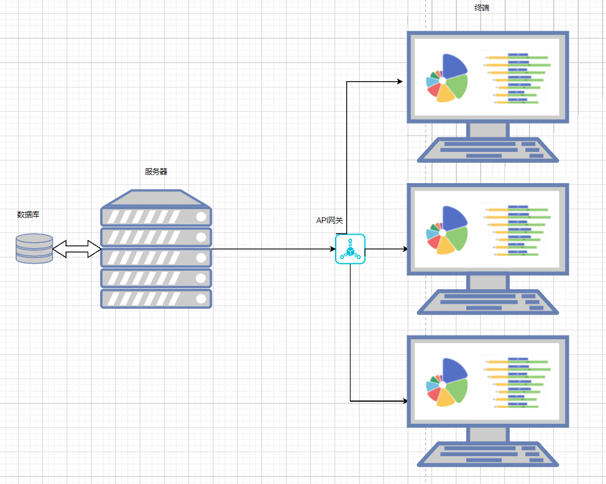

Controller负责行使分发工作，将前端发来的请求进行过滤分类，随后分发到服务器端完成响应逻辑，实现与API接口的对接。

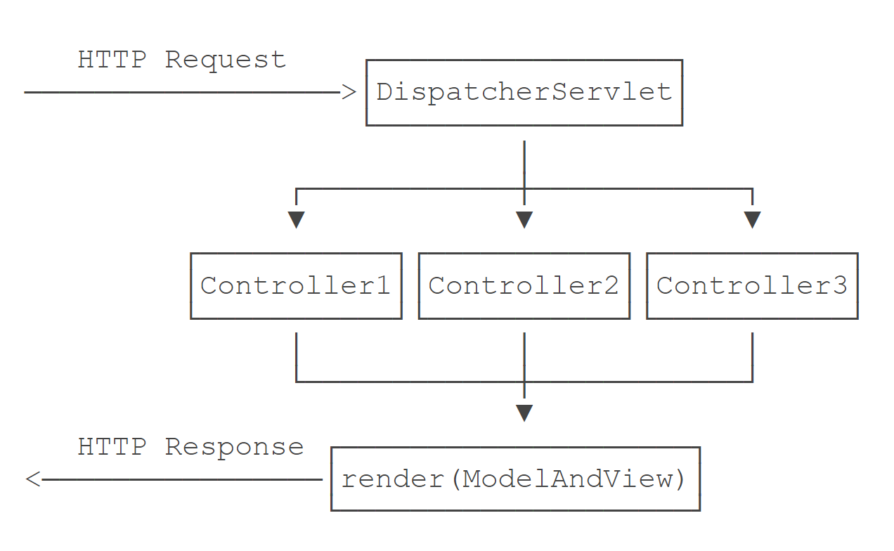

项目中的API如下：

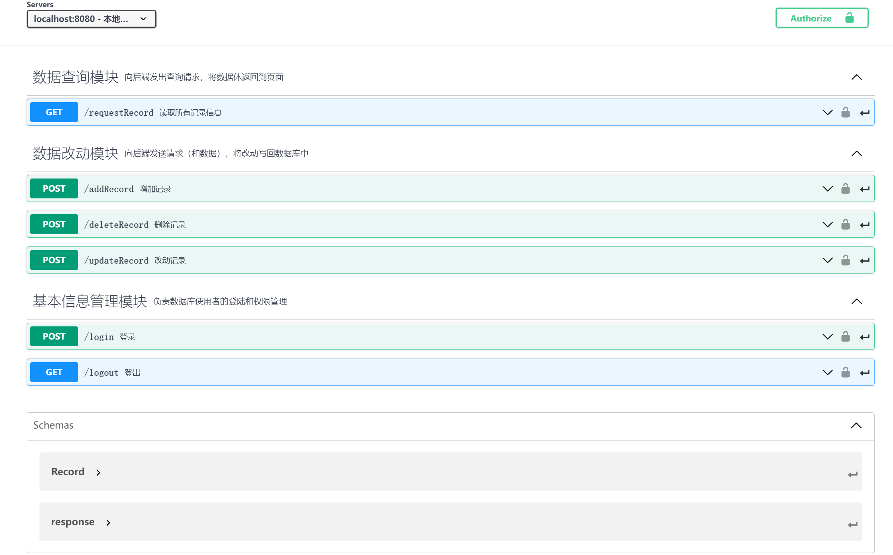


### 技术选型

前端采用JavaScript典型技术栈：

- 页面逻辑使用jQuery，CSS样式基于Bootstrap。
- 出于前端对接便利性的考虑，V端不使用JSP而使用支持Jinja2语法的模板引擎Pebble。
- 可视化展示使用ECharts。

后端基于Spring MVC开发：

- 因而管理工程采用Maven，并将容器引擎Tomcat集成到代码中，实现自启动。
- 数据库采用MySQL，选用基本的JDBC做连接。
- 其他：JSON引擎使用Jackson和fastjson，日志系统使用commons-logging和log4j

Java逻辑基于Java 8 开发。


## 具体设计

### 前端

#### 可视化分析

观察数据可知，一个国家的信息化建设程度体系结构包含“一级指标”、“二级指标”、“三级指标”这三个层级的指标，每个一级指标由若干二级指标组成，每个二级指标由若干三级指标组成，2019年数据、2020年数据、2021年数据： 包含了中、英、法、美、俄五个国家于2019、2020、2021三年中在上述指标体系下各三级指标得分情况。

我们可以从两个方面来查看数据：

1. 层次结构
2. 指标、国家、年份多维视图

#### 层次结构图

三个层级的指标将数据剖分为树形结构，可以用隐式树图来呈现三层级结构。

在指标的基础上，五个国家和三个年份的数据构成5*3的满矩阵，也可以将国家和年份嵌套到指标的树形结构中。如下两图，轻触相应指标区域，可以查看该指标的得分和其他详细信息，点击相应指标区域，可以查看该指标所包含的下一级指标。

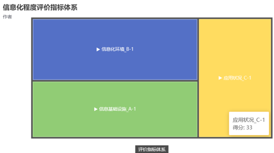

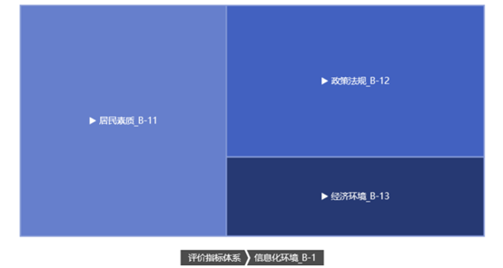


除此之外，年份是定序数据类型，国家是定类数据类型，所以设置以年份为横坐标，每个国家设置为一条折线，以此体现每个国家随时间变化下各项指标的变化。如下图所示，轻触时间轴可以查看该年份的各国指标得分。

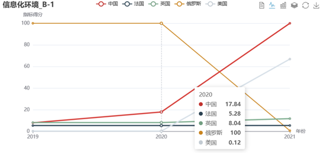

 

折线图的顶部左侧显示当前展现的指标，顶部中间可以筛选国家，顶部右侧可以切换不同的视图，如数据视图、柱状图（如下图）、堆叠图。

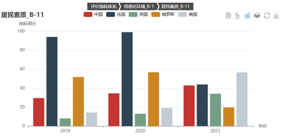

另外，层次结构图和多维视图可进行交互，这样提高了查询系统的可视性。具体而言，但用户点击层次结构图时，多维视图也会相应地显示指定的信息。

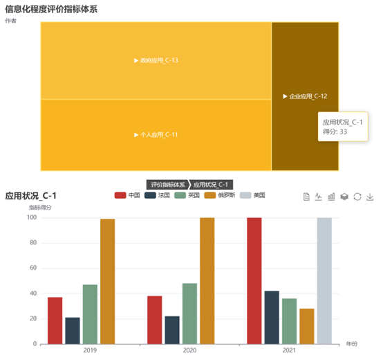

#### 表单设计

仅凭几何视图不足以展现所需的全部信息，故作者设计了可供“增删查改”的表单。如图所示，表单具有下拉框功能，可以自动补全数据库中已有的指标索引，该表单会根据用户选择自动补全的行为判断，更新次级下拉框信息。

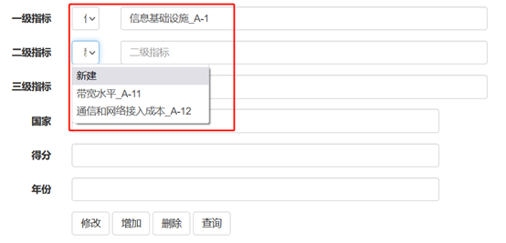

当用户在一级指标中选择A-1时，二级指标下拉框中只会呈现A-11,A-12。


点击表单底部的四个按钮，系统将捕获你的请求，并在前后端做出相应的修改查询。

完整的信息化建设程度交互系统前端设计图如下：

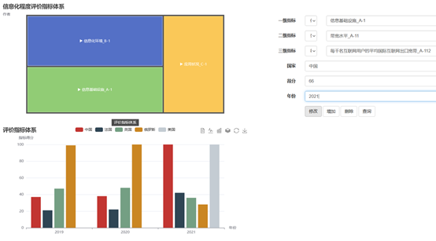

### 数据库

#### 相关设计调研

项目中要保存的数据本质上是树。利用关系型数据库表示树结构有如下两个问题：

1. 键冗余。如果将每个叶子节点的键值对都写出来的话，很显然地，每一条记录都可能有大量的NULL值。
2. 值冗余。采用朴素的父节点排列，把所有的上级节点的值都列在记录中，数据中要列举大量的重复的名称。

SQL Anti-patterns中说明了几种方法，以使SQL数据库可以保存树，并解决以上的问题。https://www.cnblogs.com/xjnotxj/p/12734792.html#1727334192


其中，递归查询在mysql中不支持。首先淘汰。

然后对比其余四种设计方案：

Ref.Integ是数据完整性，使用**路径枚举**和**嵌套集**都不能进行路径节点真实性的快速判断（因为有多级），所以实际生产中并不推荐。

**邻接表**是一种由子节点链接父节点的方法，空间占用较小，除了链接没有冗余，但是查询困难。

**闭包表**是解决分级存储的一个简单而优雅的解决方案，它记录了树中所有节点间的关系，而不仅仅只有那些直接的父子关系。但基于空间换时间的思路，需要至少两张表，才能描述清楚结构关系。http://www.mybatis.cn/archives/299.html

#### 结合数据分析

虽然我们认为数据完整性是非常重要的，但观察我们的查找目标，而后纵观这几种方法，我们会发现一些问题。

我们的项目里查询方式主要是反查，即从子节点向上查询，淘汰邻接表。同时有对某一级指标的查询，淘汰嵌套集。

路径枚举和闭包表都可以。

如果采用路径枚举的思路：由于我们的项目中，数据的层数是确定的，使用路径枚举，每条记录是清晰的三级记录，对某一级查询非常方便。

如果采用闭包表的思路：查询某一级时，需要先确定距离，再确定级别指标匹配，需要查两次。另外，叶子节点是键值对，而分支节点是单值节点，不同质给编程带来复杂性。

综上，我们采用路径枚举的思路。

另外，反思指标编号的编写方式，其实也是一种路径枚举。


#### 数据库设计图

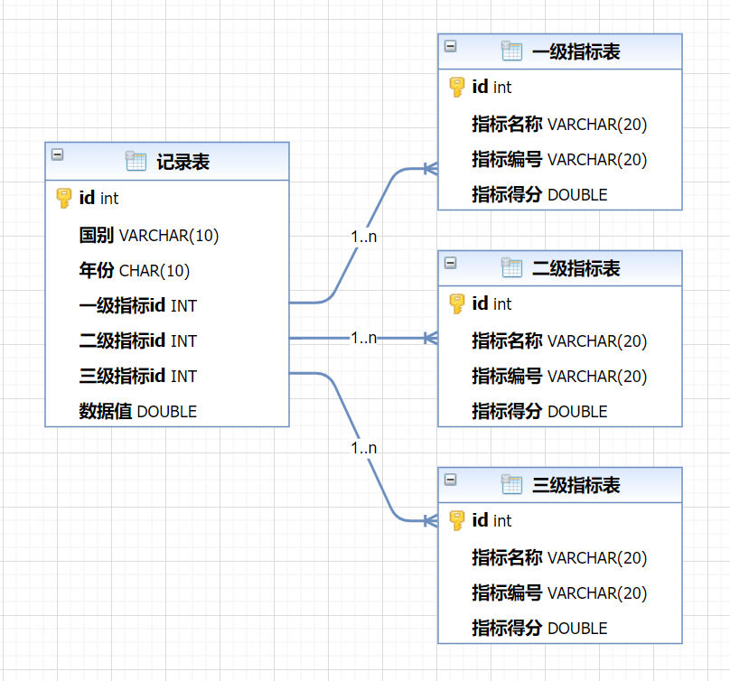

基于这样的结构，我们的增删改查操作逻辑如下：

1. 增加。

   - 增加某国某年某指标的一条记录。

     分别从三个指标表中利用指标编号查询到对应的各级指标ID，然后将一条记录的相关信息插入到记录表中。对比闭包表，则需要遍历所有节点求解距离，增删逻辑非常简明。

   - 增加一个指标及这个指标下的数据。

     增加一个指标，则在对应的级别指标表中添加对应一行指标信息。从.json数据中获取这个指标的数据，再从其他指标表中获得对应其他指标的id，最终将数据插入到记录表中。

2. 删除。

   - 删除一条记录

     只需删除对应记录即可，不需要对指标表操作。同时，由于指标和记录相互独立，满足第三范式的要求。

   - 删除一个指标及对应数据

     在指标表中查询到指标id并删除该指标信息，在记录表中用该指标id将指标下的数据选择并删除。

3. 改动。
   - 改指定指标的记录值：从指标表中找到给定指标对应的各级指标ID，在记录表中的指定对应记录数据处进行改动。另外还可以单独改写记录表中的路径，进行数据完整性的纠错，一定程度上弥补了路径枚举的缺陷。这一点上与闭包表差异不大。
   - 改某个指标：若是改指标名称则需要在指标表中找到对应指标，然后对指标名称和编号进行修改，记录表中的指标id不需要改动。

4. 查询。
   - 查询某国某级的指标时，先在对应指标表中找到对应的指标id，然后在记录表中筛选指标级别对应的一列，即可得到。对比闭包表，则需要查两次，一次筛选树上距离，一次筛选指标。
   - 查询给定指标和id的一条数据，既可以直接在记录表中通过对id的一列进行select操作获得数据即可。

### 服务器

#### MVC设计

MVC的框架实现包括如下几个方面：

1. 分发器Dispatcher
2. 数据结构Model
3. 渲染引擎View Engine


其中分发器所需的映射器在Spring中已经定义好。我们可以定义类似如下的代码来试验

```java
	@GetMapping("/signin")
	public ModelAndView signin() {
		return new ModelAndView("/signin.html");
	}

	@PostMapping("/signin")
	public ModelAndView doSignin(SignInBean bean, HttpServletResponse response, HttpSession session)
			throws IOException {
		//...
		return null;
	}

```

`/signin`可以直接定向到指定的HTML页中。

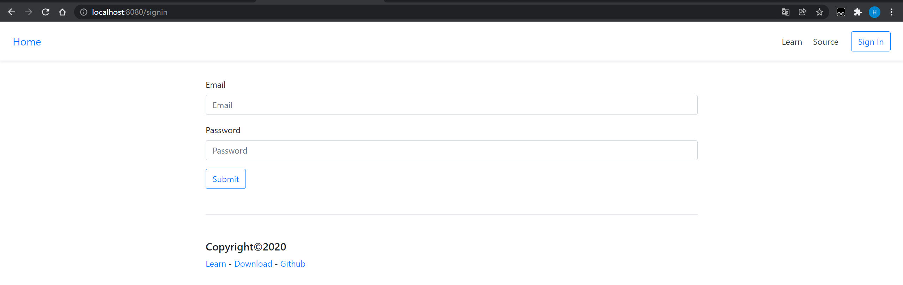


数据结构依据上述路径枚举的记录实现，基于Jackson实现JavaBean和前端数据结构的转换。在API中我们的完整数据结构如下：

```json
{
  "record_id": 100000,
  "country_name": "string",
  "index_value": 1024,
  "first_index": "string",
  "second_index": "string",
  "third_index": "string",
  "year": 2200
}
```

并随请求调整JavaBean格式。

#### 框架复刻

由于Spring抽象程度过高，对于servlet的实践作用将显而易见地变差。

所以我们在廖雪峰的java教程的基础上引入了如`src/main/framework`的复刻web框架。包括两个servlet，两个注解，引入模板引擎，以及模板对象ModelAndView。

其中：
- FileServelet向浏览器传入静态资源
- DispatcherServlet负责连接，利用反射的方式将模板引擎传来的模板以及对应参数进行调用和render
- GetMapping和PostMapping为两个仿照Spring的地址映射注解
- ViewEngine用于引入Pebble模板引擎。
- ModelAndView负责维护模板对象及其参数。

有如下几点比较重要：

第一，项目中特别使用了Pebble ViewEngine来替代JSP完成view端设计，这样可以使得view端的java代码和JavaScript实现有效的分离。Pebble还有如下几点优势：
1. 使用jinja2语法，简洁通用
2. 支持模板继承，这一点在我们的项目中也有所体现
3. 多样的过滤器

第二，mapping时，仿照Spring，使用元注解的方式定义了简明的“类装饰器”的地址映射。

第三，Dispatcher中使用了反射+invoke的方式来对接上述的注解。

#### 设计模式

Model端设计采用策略模式。在请求不同时（比如发送指标时），我们重新传入策略以组织Model。

View到Model采用观察者模式。要对传回数据库，赋有足够高的权重，并努力保证一致性。

View端在JavaScript，采用了组合模式，这一点在程序实现上是透明的。

